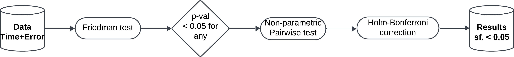

# RO47015-Group-1_data_analysis
This is a code repository for RO47015 course at TUDelft made in 2025 for HRI experiment which compares haptic and visual assistance in boom crane operation task. The primary purpose of the data analysis pipeline is to investigate between-condition effects. The experiment is within-subject design.  

## Setup
To setup the environment use

    pip install -e .

Using virtual environment is highly recommended.  

## Data structure
Default data folder is [data/](data/).  
> **Note**: all functions here are overwriting in nature. Be careful with data.  

**DO NOT REDISTRIBUTE OUTSIDE OF RO47015 COURSE FOR NOW.**  

## Statistical pipeline

